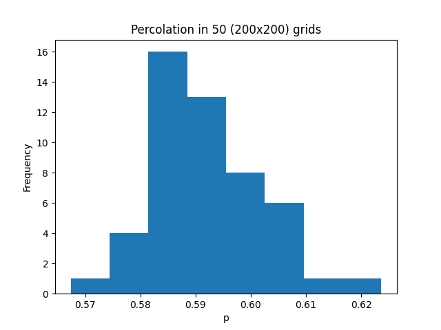
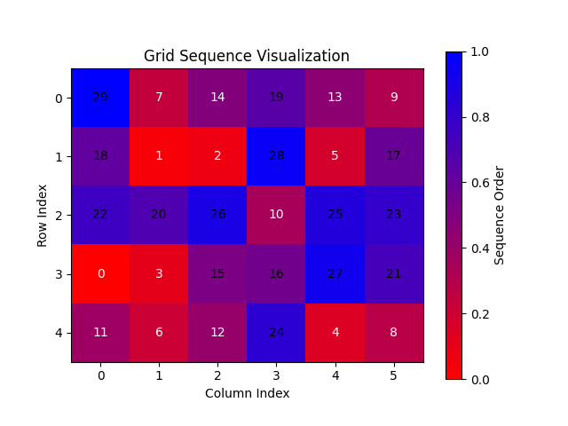
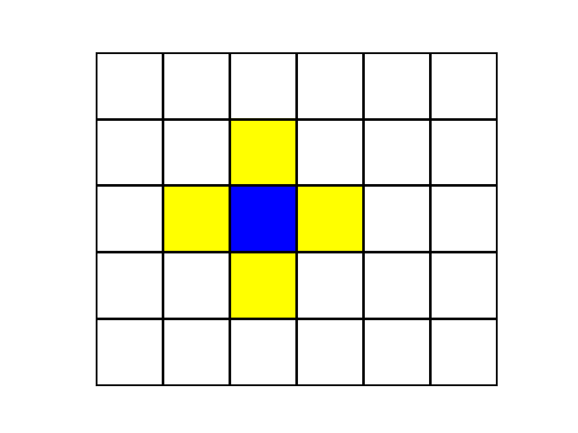
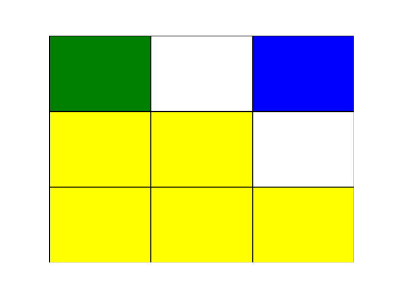

## Prerequisites
    Python 3.12+
    If you have multiple versions of python installed, please make sure the correct one is being referenced in the files in _prj/script_ 

## Setup
    prj/script> ./venv_create.sh
    
This will create a virtual environment and install the required packages (as listed in **prj/pip_reqs.txt**)

- *Note*: on Ubuntu one may need to first separately **install python3-venv**

    > sudo apt install python3-venv

- *Note*: [Poetry](https://python-poetry.org/docs/) has superior dependency handling, and should be preferred in a 
production environment. Direct use of pip was chosen here, however, as poetry requires global modifications on the developers machine, 
and I wanted to avoid requiring this of anyone else, wishing to run/test this project
  - *Note*: If you are behind a proxy you may need to configure *https_proxy* (eg export as an environment var) appropriately 
   for pip to be able to download the packages, and the app to download the files. eg:

        > export http_proxy=http://10.10.1.10:3128
        > export https_proxy=http://10.10.1.10:1080
     

## Execute
    ./prj/script/venv/bin/python -m src.main

        ...perc_value = 0.5967
        ...perc_value = 0.582025
        ...perc_value = 0.590375
        ...perc_value = 0.5999
        ...perc_value = 0.600575
        ...perc_value = 0.590325
        ...perc_value = 0.593075
        ...perc_value = 0.57915
        ...perc_value = 0.57955
        ...average p: 0.5909945 with (200x200) grid, 50 iterations in 34.69 secs 

 

## Test
    ex_auto>  ./prj/script/venv/bin/pytest test/

    ============================= test session starts ==============================
    collecting ... collected 8 items
    
    test__algorithm.py::test_cell_picker_seq_random PASSED                   [ 12%]
    test__algorithm.py::test_cell_stepper PASSED                             [ 25%]
    test__cluster.py::test_grid_create <- ../../SiMo/test/test__cluster.py PASSED [ 37%]
    test__experiment.py::test_experiment <- ../../SiMo/test/test__experiment.py PASSED [ 50%]...perc_value = 0.55
    ...0.0 secs for (5x4) grid
    
    test__grid.py::test_grid_create PASSED                                   [ 62%]
    test__grid.py::test_adjacent_cells_multiple PASSED                       [ 75%]
    test__percolates.py::test_grid_percolates <- ../../SiMo/test/test__percolates.py PASSED [ 87%]
    test__stepper.py::test_stepper PASSED                                    [100%]
    
    ======================== 8 passed, 16 warnings in 1.15s ========================                                                                                                                               [100%]
    

## Check Typing
    >  ./prj/script/venv/bin/mypy --check-untyped-defs -p test -p src
